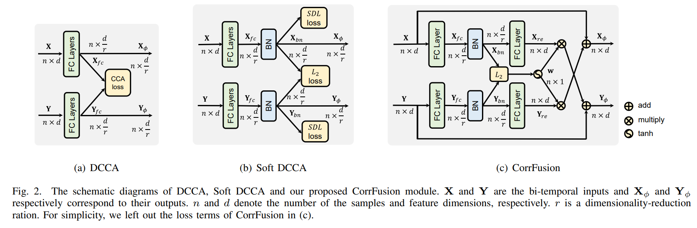
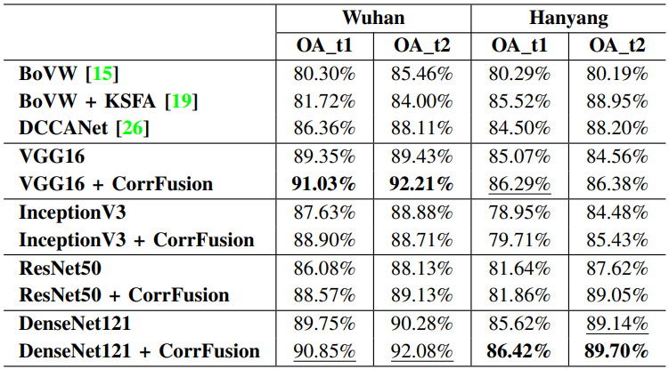
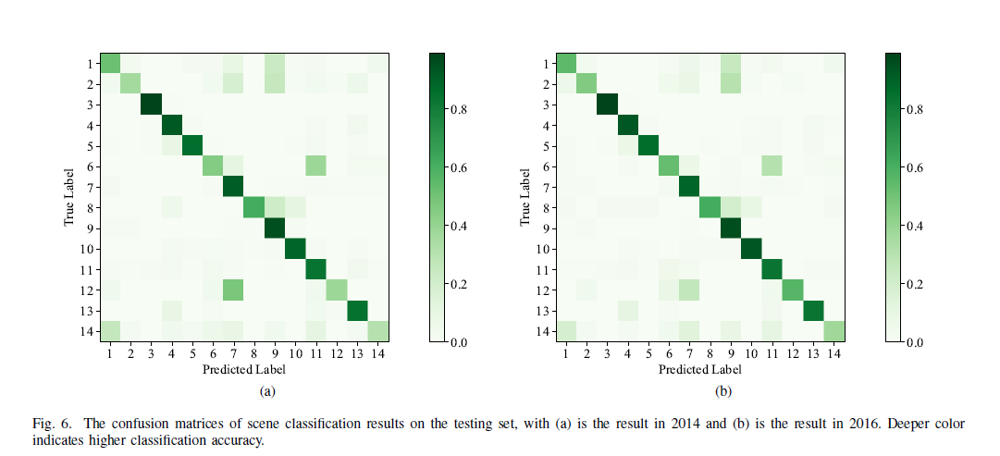

# CorrFusionNet: Temporal Correlation based Fusion Network
Code for CorrFusionNet: Correlation based Fusion Network Towards Detecting Scene Changes of Multi-Temporal High-Resolution Imagery.
Work in progress.
## Introduction
We proposed a unified network called CorrFusionNet for scene change detection. The proposed CorrFusionNet firstly extracts the features of the bi-temporal inputs with deep convolutional networks. Then the extracted features will be projected into a lower dimension space to computed the instance level canonical correlation. The cross-temporal fusion will be performed based on the computed correlation in the CorrFusion module. The final scene classification and scene change results are obtained with softmax activation layers. In the objective function, we introduced a new formulation for calculating the temporal correlation. The visual results and quantitative assessments both demonstrated that our proposed CorrFusionNet could outperform other scene change detection methods and some state-of-the-art methods for image classification.

## CorrFusion Module
- The proposed CorrFusion module:

- The proposed CorrFusionNet:


## Requirements


## Data

```
F:.
├─trn
│      0-5000.npz
│      10000-11691.npz
│      5000-10000.npz
│
├─tst
│      0-3341.npz
│
└─val
        0-1670.npz
```

## Usage


## Results
- The results of quantitative assessments:

- The confusion matrices the bi-temporal classification results by CorrFusionNet:

## Contact
[rulxiaing](mailto:rulxiaing@outlook.com)
