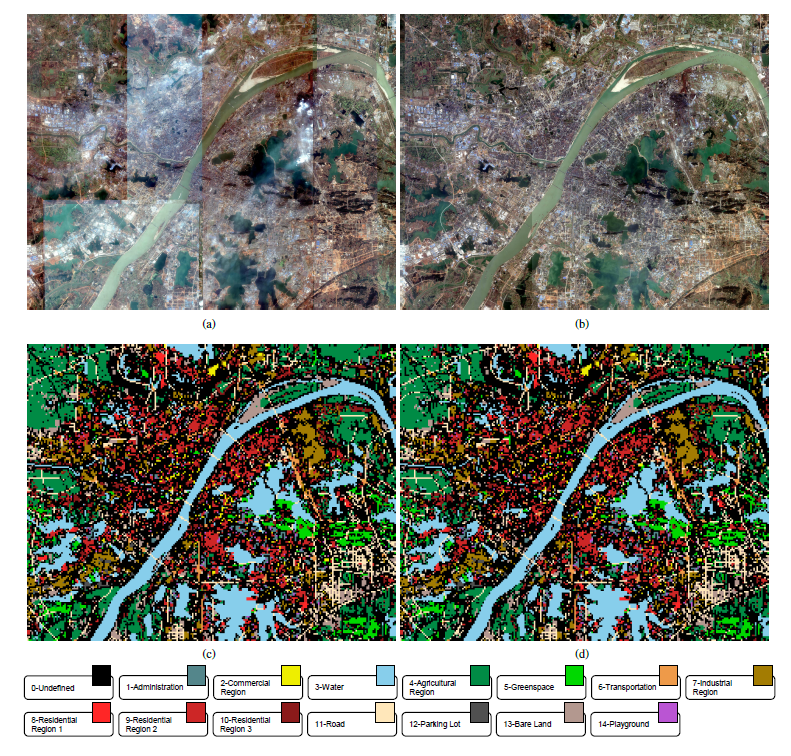
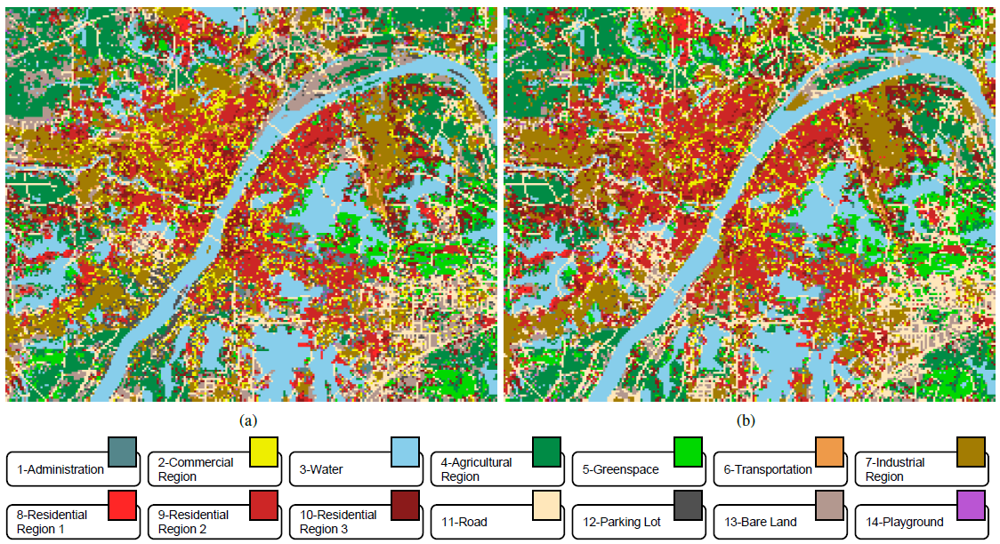

# Multi-Temporal Scene Classification and Scene Change Detection with Correlation based Fusion
Code for Multi-Temporal Scene Classification and Scene Change Detection with Correlation based Fusion.
To acquire dataset, please visit this [URL](http://sigma.whu.edu.cn/newspage.php?q=2021_06_27)(In Chinese), or contact chen.wu@whu.edu.cn.

## Introduction

We proposed a unified network called CorrFusionNet for scene change detection. The proposed CorrFusionNet firstly extracts the features of the bi-temporal inputs with deep convolutional networks. Then the extracted features will be projected into a lower dimension space to computed the instance level canonical correlation. The cross-temporal fusion will be performed based on the computed correlation in the CorrFusion module. The final scene classification and scene change results are obtained with softmax activation layers. In the objective function, we introduced a new formulation for calculating the temporal correlation. The visual results and quantitative assessments both demonstrated that our proposed CorrFusionNet could outperform other scene change detection methods and some state-of-the-art methods for image classification.


## CorrFusion Module
- The proposed CorrFusion module:
<div align=center>

</div>

- The proposed CorrFusionNet:
<div align=center>

</div>

## Requirements
```
scipy==1.1.0
matplotlib==3.0.3
h5py==2.8.0
numpy==1.16.3
tensorflow_gpu==1.8.0
Pillow==6.2.1
scikit_learn==0.21.3
```

## Data

- Overview of our Wuhan dataset

<div align=center>

</div>

The images are stored in npz format.
```
├─trn
│      0-5000.npz
│      10000-15000.npz
│      15000-16488.npz
│      5000-10000.npz
│
├─tst
│      0-4712.npz
│
└─val
       0-2355.npz
```

## Usage
### Install the requirements
```
pip install -r requirements.txt
```

### Run the training code
```
python train_cnn.py [-h] [-g GPU] [-b BATCH_SIZE] [-e EPOCHES]
                    [-n NUM_CLASSES] [-tb USE_TFBOARD] [-sm SAVE_MODEL]
                    [-log SAVE_LOG] [-trn TRN_DIR] [-tst TST_DIR]
                    [-val VAL_DIR] [-lpath LOG_PATH] [-mpath MODEL_PATH]
                    [-tbpath TB_PATH] [-rpath RESULT_PATH]
```
(see [parser.py](./parser.py))

### Evaluate on a trained model:
- Download a trained model [here](https://pan.baidu.com/s/1kxqzb4DuK3eVczSl88rDWA).

- Evaluation
```
python evaluate_model.py [-h] [-g GPU] [-m MODEL_DIR] [-tst TST_DIR]
                         [-val VAL_DIR]

optional arguments:
  -h, --help            show this help message and exit
  -g GPU, --gpu GPU     gpu device ID
  -m MODEL_DIR, --model_dir MODEL_DIR
                        model directory
  -tst TST_DIR, --tst_dir TST_DIR
                        testing file dir
  -val VAL_DIR, --val_dir VAL_DIR
                        validation file dir

```

## Results
- The results of quantitative assessments:
<div align=center>

</div>

- Predictions on our dataset:
<div align=center>

</div>

## Contact
For any questions, you're welcomed to contact [Lixiang Ru.](mailto:rulxiaing@outlook.com)
